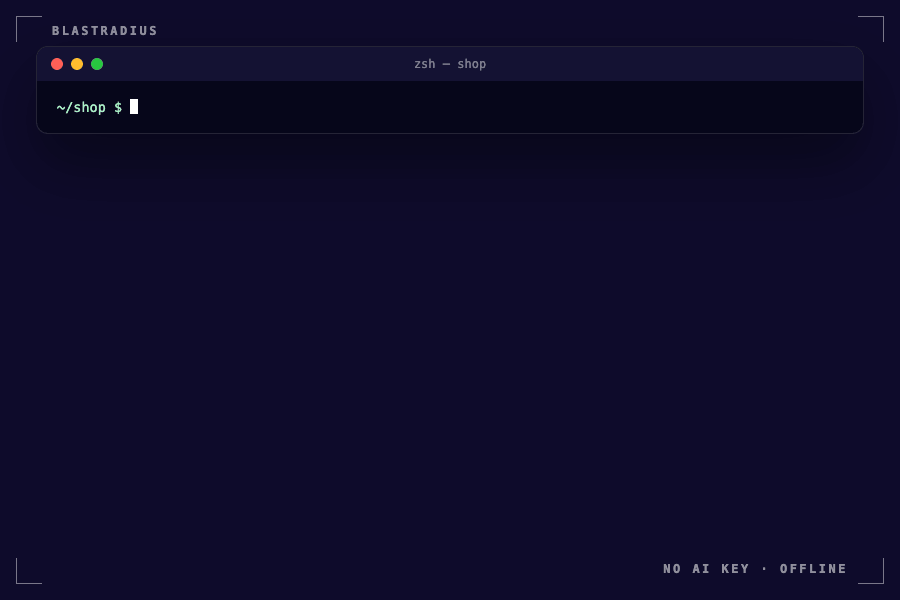
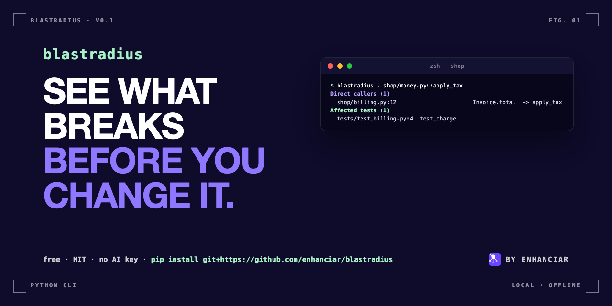

# blastradius

**See what breaks before you change a function.**



`blastradius` parses a Python repo, builds its call graph and import graph, and
tells you what depends on the function or file you're about to change:

- **direct callers**, with the exact call site (`file:line`)
- **transitive dependents**, N hops out, with the chain that reaches them
- **affected tests**, meaning the test functions that reach your target

It runs locally. It has no dependencies, needs no AI key and makes no network calls. You need Python 3.10+.

`grep` tells you where a name appears. `blastradius` tells you what depends on it.

## Install

```bash
pip install blastradius-py      # once published (command is `blastradius`); until then:
pip install git+https://github.com/enhanciar/blastradius
# or from a checkout
pip install -e .
```

## Usage

```bash
blastradius <repo_path> <function_or_file> [--depth N] [--json] [--exclude PATH] [--all]
```

| Target form | Example |
|---|---|
| bare name (all definitions with that name) | `charge` |
| method | `Invoice.total` |
| qualified | `src/billing.py::charge` |
| file (every definition in it, plus importers) | `src/billing.py` or just `billing.py` |

Options:
- `-d/--depth N` sets how many hops of transitive dependents to walk (default 3).
- `--json` prints machine-readable output for CI, editors and agents.
- `-x/--exclude PATH_OR_GLOB` skips a directory or glob. You can repeat it.
- `--all` stops long lists from being cut off at 40 items.

The exit code is 0 when the target is found, 1 when it isn't (close matches are
suggested), and 2 when the repo path is bad.

## Demo: `psf/requests`

```bash
git clone --depth 1 https://github.com/psf/requests && cd requests
blastradius . src/requests/utils.py::get_netrc_auth --depth 2
```

```text
blastradius: 37 files, 787 definitions, 1044 edges (0.08s)

Target: src/requests/utils.py::get_netrc_auth
  defined at src/requests/utils.py:231

Direct callers (5)
  src/requests/sessions.py:330             SessionRedirectMixin.rebuild_auth  -> get_netrc_auth
  src/requests/sessions.py:538             Session.prepare_request  -> get_netrc_auth
  tests/test_utils.py:162                  TestGetNetrcAuth.test_works  -> get_netrc_auth  [test]
  tests/test_utils.py:170                  TestGetNetrcAuth.test_not_vulnerable_to_bad_url_parsing  -> get_netrc_auth  [test]
  tests/test_utils.py:180                  TestGetNetrcAuth.test_empty_default_credentials_ignored  -> get_netrc_auth  [test]

Transitive dependents (14, up to 2 hops)
  hop 2  src/requests/sessions.py:186   SessionRedirectMixin.resolve_redirects  (via SessionRedirectMixin.rebuild_auth <- get_netrc_auth)
  hop 2  src/requests/sessions.py:557   Session.request  (via Session.prepare_request <- get_netrc_auth)
  hop 2  tests/test_requests.py:167   TestRequests.test_params_original_order_is_preserved_by_default  (via Session.prepare_request <- get_netrc_auth)  [test]
  hop 2  tests/test_requests.py:320   TestRequests.test_header_and_body_removal_on_redirect  (via Session.prepare_request <- get_netrc_auth)  [test]
  hop 2  tests/test_requests.py:337   TestRequests.test_transfer_enc_removal_on_redirect  (via Session.prepare_request <- get_netrc_auth)  [test]
  hop 2  tests/test_requests.py:496   TestRequests.test_headers_on_session_with_None_are_not_sent  (via Session.prepare_request <- get_netrc_auth)  [test]
  hop 2  tests/test_requests.py:504   TestRequests.test_headers_preserve_order  (via Session.prepare_request <- get_netrc_auth)  [test]
  hop 2  tests/test_requests.py:624   TestRequests.test_respect_proxy_env_on_send_session_prepared_request  (via Session.prepare_request <- get_netrc_auth)  [test]
  hop 2  tests/test_requests.py:1158  TestRequests.test_unicode_method_name_with_request_object  (via Session.prepare_request <- get_netrc_auth)  [test]
  ...
Affected tests (15)
  tests/test_requests.py:320  TestRequests.test_header_and_body_removal_on_redirect
  tests/test_requests.py:496  TestRequests.test_headers_on_session_with_None_are_not_sent
  tests/test_requests.py:504  TestRequests.test_headers_preserve_order
  ...
Summary: 5 direct, 14 transitive, 3 other files (1 non-test), 15 tests
```

Changing `get_netrc_auth` reaches `Session.request` in two hops. The output also
lists the 15 test functions to run before merging.

Here is a smaller example. It uses the fixture shipped in `tests/fixtures/shop`:

```text
blastradius: 6 files, 11 definitions, 13 edges (0.00s)

Target: shop/money.py::apply_tax
  defined at shop/money.py:5

Direct callers (1)
  shop/billing.py:12                       Invoice.total  -> apply_tax

Transitive dependents (3, up to 3 hops)
  hop 2  shop/billing.py:15    charge  (via Invoice.total <- apply_tax)
  hop 3  shop/api.py:4     checkout  (via charge <- Invoice.total)
  hop 3  tests/test_billing.py:4     test_charge  (via charge <- Invoice.total)  [test]

Affected tests (1)
  tests/test_billing.py:4  test_charge

Summary: 1 direct, 3 transitive, 3 other files (2 non-test), 1 tests
```

## JSON output

```bash
blastradius . apply_tax --json
```

The output has these keys: `found`, `resolved[]`, `direct_callers[]` (each with `fqn`,
`site`, `via` (`calls` or `imports`) and `is_test`), `transitive_dependents[]` (with
`hops` and `path`), `affected_files[]`, `affected_tests[]`, `depends_on[]`, and
`stats` (files, edges, parse errors, seconds). If the target isn't found you get
`found: false`, plus `error` and `suggestions`.

## Library use

```python
from blastradius import build_graph, compute_impact

g = build_graph("path/to/repo", exclude=["vendor"])
report = compute_impact(g, "billing.py::charge", depth=3)
```

`compute_impact` never raises. If something goes wrong, it returns `found: False` with an `error`.

## How it works

1. Walks every `.py` file. It skips `.git`, virtualenvs, `node_modules`, `build`, `dist` and dot-dirs.
2. Parses each file with the standard-library `ast` module. It records functions, classes and methods,
   every call and the definition that makes it, and imports, including relative ones and aliases.
3. Resolves each call to a definition, in this order:
   `self.x()` on the enclosing class, then `from mod import x`, then `module.x()`,
   then the same file, then a name that is unique across the repo, then a name defined in a file the caller imports.
   If a call is still ambiguous, it is **dropped, not guessed**. The graph misses some edges rather than inventing them.
4. Walks the graph backwards (breadth-first) from the target to find everything that depends on it.

## Limits

This is static analysis, so read the results as a strong hint, not proof.

- **Python only.** JS/TS are not parsed yet.
- **Dynamic calls are invisible.** That includes `getattr`, callbacks passed around as values,
  dependency injection, decorators that swap functions, and string-based dispatch.
- **Method calls on objects of unknown type** (`obj.save()`) resolve only when the name
  is unique in the repo, or defined in a file the caller imports. Common names like
  `get`, `run` and `save` on other objects are often dropped.
- **Inheritance is not followed.** Calling `Base.method` through a subclass instance may be missed.
- **Tests count only when they reach the target through the graph.** Tests that exercise
  code over HTTP, or through fixtures only, won't show up.
- A bare name that several classes define (e.g. `send`) uses all of those definitions
  as targets. Use `path.py::Class.method` to pick one.
- Files that fail to parse are skipped and listed in `--json` under `stats.parse_errors`.

## Development

```bash
python -m venv .venv && . .venv/bin/activate
pip install -e '.[test]'
pytest
```

## License

MIT © Enhanciar

---

Built by [Enhanciar](https://enhanciar.in) (enhanciar.in), a company brain that answers with sources.

---


